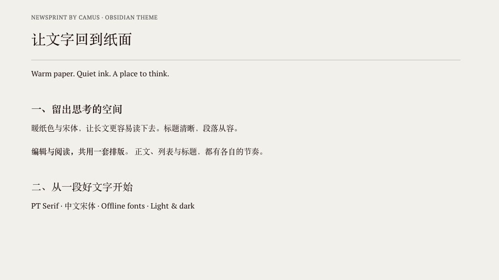

# Newsprint by Camus
A warm paper and serif theme for Obsidian, inspired by Typora Newsprint. Independently written for Obsidian; not an official Typora product.

## Features
- Warm paper (#f3f2ee), restrained ink (#1f0909), offline PT Serif, and Chinese serif fallbacks.
- Shared paragraph spacing and heading rhythm across Reading view and Live Preview.
- Light mode follows Newsprint; dark mode is a companion palette.
- Optional Style Settings controls for font size, line height, paragraph spacing, width and colors.
## Install
Download `theme.css` and `manifest.json` from the [latest release](https://github.com/CamusZ11/obsidian-newsprint/releases/latest). Put them in `<vault>/.obsidian/themes/Newsprint by Camus/`, then select **Newsprint by Camus** in Settings → Appearance. Community directory submission is pending; GitHub publication does not mean the theme is listed in the in-app market.
## Compact Markdown
Consecutive source lines without blank separators normally render as soft line breaks. For notes that use each source line as a paragraph, install the optional [Newsprint Paragraphs companion](https://github.com/CamusZ11/obsidian-newsprint-paragraphs). The theme installer does not install this plugin. It changes displayed prose only and does not edit notes. Conventional Markdown separated by blank lines works without the companion.
## Compatibility
Minimum Obsidian 1.10.6. Verified on macOS / Obsidian 1.13.7. Desktop Live Preview and Reading view were checked with 16px and 20px text, compact paragraphs, blank separators, headings and lists. Mobile and Windows have not yet been visually tested. Source mode intentionally retains Markdown syntax. Cursor-active markup can change line wrapping in Live Preview.
If existing CSS snippets override font, spacing, width or colors, disable only the conflicting snippets after inspecting them. No plugin is required for the main theme. Style Settings is optional.
## License and credits
Theme code: MIT, see [LICENSE](LICENSE). Embedded PT Serif: Copyright (c) 2010 ParaType Ltd.; SIL Open Font License 1.1, see [OFL.txt](OFL.txt). The full font license is also included in `theme.css` so the installed theme retains it. Fonts are unmodified; embedding does not change their license.
Visual reference: [Typora default Newsprint](https://github.com/typora/typora-default-themes/blob/master/themes/newsprint.css). Obsidian-specific selectors and controls were authored for this adaptation.
## 中文
暖纸色、宋体类中文字体、PT Serif 英文字体与克制的标题层级。设置 → Style Settings → Newsprint by Camus 可同步调整实时预览和阅读视图的段落间距；16px 正文默认段距为 24px。不留空行的紧凑笔记需要另行安装段落辅助插件。纯源码模式仍显示 Markdown 标记。

## Development
Run `pnpm install` and `pnpm run lint`. The configuration extends Obsidian's official Stylelint preset. Obsidian's built-in CodeMirror names are exempt from kebab-case; exact spacing ratios retain six decimal places. Mutually exclusive editor line variants have a scoped specificity exception. The preset reports 18 `:has()` performance advisories: these selectors are confined to Live Preview `.cm-line` children and immediate siblings, for parity without editing source. Long-note performance and mobile visual verification remain areas for follow-up.
