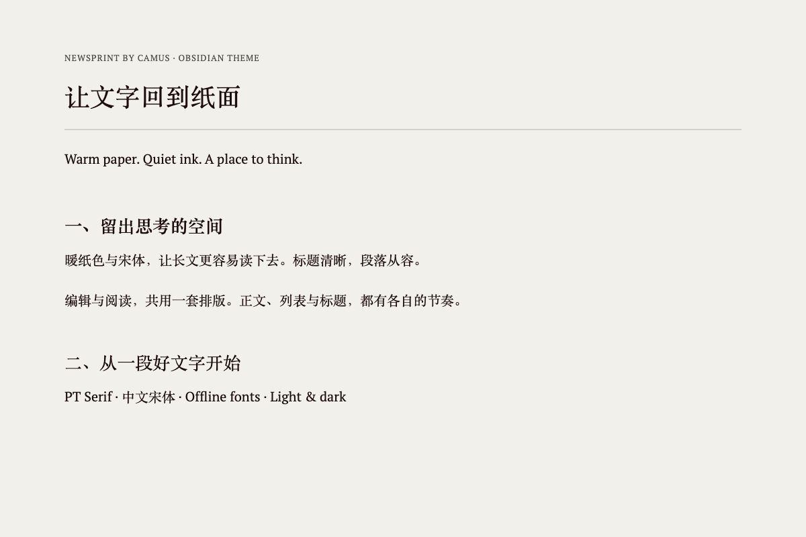
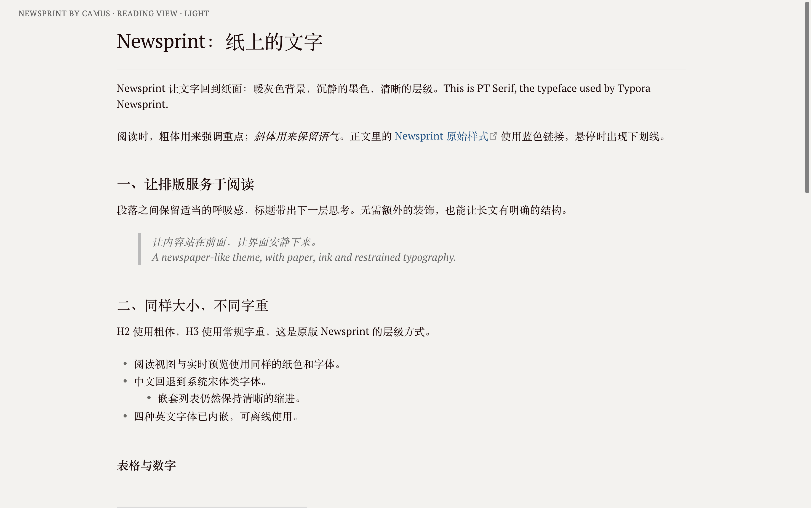
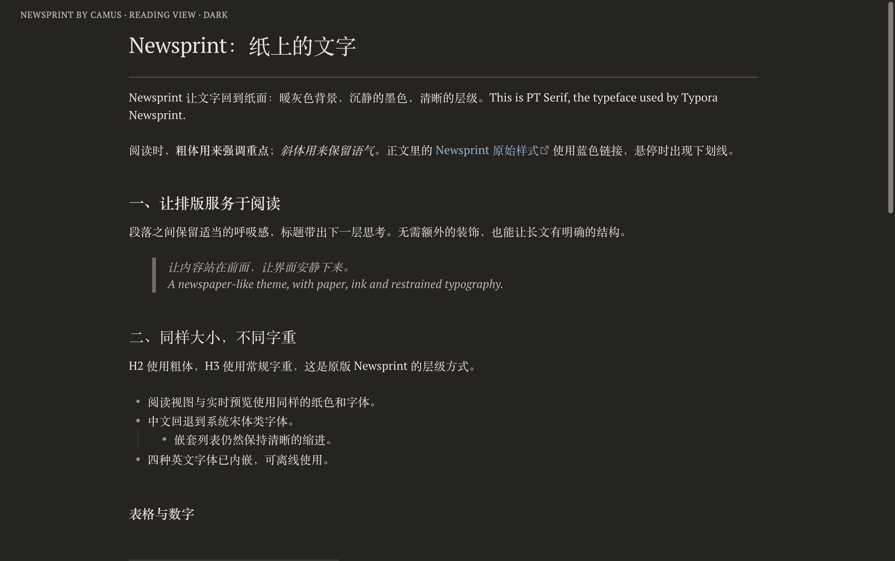
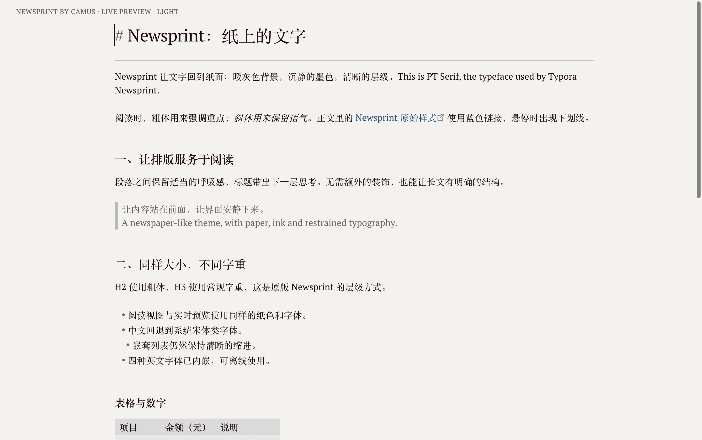

# Newsprint by Camus

让文字回到纸面。一个受 Typora Newsprint 启发的 Obsidian 主题，保留暖纸色、沉静墨色和衬线字体，让长文、学习笔记与写作草稿有清晰的阅读节奏。

A warm paper and serif theme for Obsidian, inspired by Typora Newsprint, with shared typography across Live Preview and Reading view.



[下载最新版本](https://github.com/CamusZ11/obsidian-newsprint/releases/latest) · [反馈问题](https://github.com/CamusZ11/obsidian-newsprint/issues) · [段落辅助插件](https://github.com/CamusZ11/obsidian-newsprint-paragraphs)

## 特点

- **纸张与墨色**：浅色使用 `#f3f2ee` 暖纸色与 `#1f0909` 墨色；深色使用配套的柔和暗色方案。
- **中英文衬线字体**：内嵌 PT Serif 常规、粗体、斜体与粗斜体，离线可用；中文优先使用系统宋体类字体。
- **编辑与阅读共用排版参数**：实时预览与阅读视图共享字号、行高、段距和标题层级。
- **克制的细节**：细分隔线、蓝色链接、灰色表格，以及配套的列表、引用、代码和提示框样式。
- **可调整的阅读体验**：通过可选的 Style Settings 插件调整字体、字号、段距、正文宽度和浅色配色。

主题本身无需插件。对于“正文每行都是一段、段间不留空行”的笔记，可另装 Newsprint Paragraphs。

## 截图

以下实拍来自 macOS / Obsidian 1.13.7，使用主题 1.0.2、16px 正文和同一篇中英文演示笔记。演示笔记采用不留空行的正文写法，已启用 Newsprint Paragraphs。为便于观察排版，截图时临时隐藏工作区其他内容，并统一正文展示宽度；截图标签仅用于说明模式。

### 浅色与深色 · 阅读视图

| 浅色 · Warm paper | 深色 · Quiet dark |
| --- | --- |
|  |  |

### 实时预览 · 编辑模式

同一篇笔记在实时预览中的效果。标题所在的光标行会显示 Markdown 标记；可与上方浅色阅读截图对照段距和标题层级。



## 安装与更新

### 从 Obsidian 主题市场安装

在 **设置 → 外观 → 主题 → 管理** 中搜索 **Newsprint by Camus**，找到后选择安装并使用。如果主题市场暂时无法搜索到，可使用下方手动安装方式。

### 手动安装

1. 从 [最新 Release](https://github.com/CamusZ11/obsidian-newsprint/releases/latest) 下载 `theme.css` 和 `manifest.json`。

2. 在你的仓库中创建 `.obsidian/themes/Newsprint by Camus/`，将两个文件放入该目录。

3. 打开 **设置 → 外观**，选择 **Newsprint by Camus**；未出现时重新加载 Obsidian。

```text
你的仓库/
└── .obsidian/
    └── themes/
        └── Newsprint by Camus/
            ├── manifest.json
            └── theme.css
```

### 更新主题

通过主题市场安装后，在 **设置 → 外观 → 检查更新** 中更新；Obsidian 不会在后台自动安装主题更新。手动安装则重新下载最新版本的两个文件，替换同目录文件并重新加载主题。详见 [Obsidian 官方主题更新说明](https://help.obsidian.md/themes)。

## 调整排版

安装并启用可选的 [Style Settings](https://github.com/mgmeyers/obsidian-style-settings) 插件后，进入 **设置 → Style Settings → Newsprint by Camus**。

| 设置 | 默认值 | 作用 |
| --- | --- | --- |
| 正文字号 | 16px | 同步调整实时预览与阅读视图 |
| 正文行高 | 1.5 | 调整同一段落内的行距 |
| 段落间距 | 字号的 1.5 倍 | 16px 正文对应 24px 段距 |
| 正文最大宽度 | 40em | 大窗口默认扩展到 914px，可自行指定 |
| 正文字体 | PT Serif + 系统中文宋体回退 | 调整中英文正文与界面字体 |
| 浅色纸张 / 正文颜色 | `#f3f2ee` / `#1f0909` | 自定义浅色配色 |

PT Serif 的四种字形已随主题内嵌；中文字体依赖系统已有字体，未内嵌中文字体。不同平台的中文显示可能略有不同。

## 不留空行的笔记

标准 Markdown 用空行区分段落，这种写法只安装主题即可：

```markdown
这是第一段。

这是第二段。
```

如果你的笔记习惯是这样写：

```markdown
这是第一段。
这是第二段。
```

标准 Markdown 会将它们视为同一段的软换行。若希望每行都显示为独立段落，请另行安装 [Newsprint Paragraphs](https://github.com/CamusZ11/obsidian-newsprint-paragraphs)，主题安装不会自动安装该插件。

辅助插件只调整顶层正文的显示，不改写笔记文件，不改变列表、引用、提示框、表格或代码。顶层正文的手动硬换行也会显示为段落；需要保留段内换行语义时，关闭辅助插件。

## 兼容性与常见问题

- 最低支持 **Obsidian 1.10.6**；已在 **macOS / Obsidian 1.13.7** 验证实时预览与阅读视图，包括 16px / 20px 正文、标题、列表及两种分段写法。
- Windows 和移动端尚未完成视觉验证。
- 编辑排版指 **实时预览**；纯源码模式保留 Markdown 标记。光标激活的语法标记可能影响换行位置。

### 编辑与阅读的段距不同？

先确认使用实时预览，再检查笔记是否用空行分段。不留空行、且希望逐行分段时需要启用辅助插件；两种模式应使用相同的 Style Settings 参数。

### 字体、间距或颜色与截图不同？

检查现有 CSS 片段及其他插件是否覆盖字体、`margin`、`padding`、行高、段距或正文宽度。定位冲突后，只停用相关片段。截图使用统一展示宽度，实际换行位置也会随窗口宽度变化。

## 反馈

欢迎通过 [GitHub Issues](https://github.com/CamusZ11/obsidian-newsprint/issues) 报告问题或提出建议。请附上 Obsidian 版本、操作系统、深浅色模式、实时预览或阅读视图、相关 CSS 片段 / 插件，以及可复现的示例与截图。提交前请移除截图中的私人笔记内容。

## 更新记录

### 1.0.2

修复浅色搜索结果出现白字的问题，并检查文件重命名、活动导航项、标签与计数、最近仓库、同步历史，以及深浅色中的错误 / 成功提示和弱化文本。字号、字体与段落间距保持不变。

[查看完整 Release 记录](https://github.com/CamusZ11/obsidian-newsprint/releases)

## Development

Run `pnpm install` and `pnpm run lint`. The configuration extends Obsidian's official Stylelint preset. Obsidian's built-in CodeMirror names are exempt from kebab-case; exact spacing ratios retain six decimal places. Mutually exclusive editor line variants have a scoped specificity exception. The preset reports 18 `:has()` performance advisories: these selectors are confined to Live Preview `.cm-line` children and immediate siblings, for parity without editing source. Long-note performance and mobile visual verification remain areas for follow-up.

`scripts/check-contrast.js` evaluates to an async function accepting Obsidian's installed `app.css` and the release `theme.css` as strings. Run it in Obsidian DevTools. It checks 49 native text/color states in both light and dark modes against a 4.5:1 minimum, using a disposable iframe without user snippets or plugins. Hover/focus selectors are mirrored by test classes and animations are disabled for stable measurements; mobile-tap selectors are included, but this is not a mobile-device visual test. It removes the iframe and leaves the user's appearance unchanged.

## 许可与来源

- 主题代码采用 MIT，见 [LICENSE](LICENSE)。
- 内嵌 PT Serif：Copyright © 2010 ParaType Ltd.，采用 SIL Open Font License 1.1，见 [OFL.txt](OFL.txt)。字体未经修改，完整字体许可也包含在 `theme.css` 中。
- 视觉参考 [Typora 默认 Newsprint 主题](https://github.com/typora/typora-default-themes/blob/master/themes/newsprint.css)。Obsidian 的选择器、设置控件与适配由 Camus 独立编写。

本项目是独立的 Obsidian 适配，不代表 Typora 官方产品。
